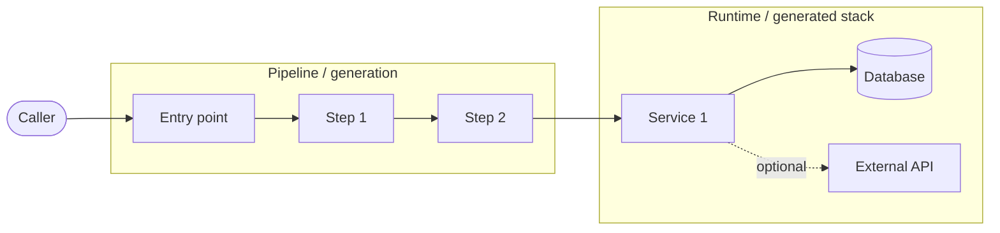

# README sections — templates and best practices

Reference for the `writing-a-readme` skill. Each section below has:

- **When to include** — universal (always) or condition (only when applicable)
- **Template** — markdown stub to adapt
- **Principles** — best-practice notes
- **Forge example** — pointer into `forge/README.md` for a polished real-world instance (see [github.com/cchifor/forge](https://github.com/cchifor/forge/blob/main/README.md))

> Forge-example line numbers are accurate as of forge `1.1.0-alpha.2`. If forge's README has been edited and the lines no longer match, fall back to grepping for the section heading (e.g., `## Quick Start`) — heading names are stable across edits.

The order below is the order sections should appear in the generated README.

---

## 1. Header (universal)

**When to include:** every README.

**Template:**
````markdown
<div align="center">

# <project-name>

*<one-line tagline that says what this is and who it's for>*

[](<repo-releases-url>)
[](<lang-url>)
[](LICENSE)
[](<repo-url>)
[](<actions-url>)
[](CONTRIBUTING.md)

</div>
````

**Principles:**

- Tagline goes inside `*…*` (italic), one line, names the audience and the headline value.
- All badges in `flat-square` style for visual consistency.
- Every badge links somewhere real (release page, language docs, license file, CI run, contributing guide). No dead badges.
- For polyglot projects, add per-language badges. For projects with a feature catalog, add count badges (`backends-3`, `options-38`) — but only when the count is informative.
- Skip vanity badges (downloads, stars) unless they tell the reader something useful.

**Forge example:** `forge/README.md:1-17`.

---

## 2. "What's new?" callout (recommended, post-0.1)

**When to include:** project has at least one tagged release (`git tag` non-empty).

**Template:**
````markdown
> **What's new?**
>
> - **Unreleased / next** — <one-line summary of what's on main but unshipped>.
> - **<latest-version>** — <one-line summary of the headline change; secondary changes inline>.
> - **<prev-version>** — <one-line summary>.
>
> See [`CHANGELOG.md`](CHANGELOG.md) for the full delta, [`UPGRADING.md`](UPGRADING.md) for migration notes.
````

**Principles:**

- Three to five bullets max — readers want the recent diff, not the changelog.
- Lead with the unreleased / latest entry, work backward.
- Each bullet is one sentence; link to the changelog for detail.
- Prune as the project ages — no entry older than the last two minor versions.
- Skip entirely for pre-0.1 projects with no releases.

**Forge example:** `forge/README.md:19-25`.

---

## 3. Intro paragraph (universal)

**When to include:** every README.

**Template:**
````markdown
`<project>` is a <noun-phrase> that <one-sentence purpose>. Where [<alternative-1>](<url>) and [<alternative-2>](<url>) <do X with constraint Y>, `<project>` <does Y differently and why that matters>. <Optional: one closing sentence on audience or operating mode — e.g., humans + AI agents.>
````

**Principles:**

- One paragraph, one job — answer "what is this and why is it different?".
- Always name two or three alternatives the reader has heard of, and explicitly contrast them. Without comparison, the reader can't position the project.
- Hyperlink every named tool/library on first mention.
- If the audience includes AI agents (CLI with JSON output, headless mode), call it out in the closing sentence. Forge says "designed to be driven by humans in a terminal **and** by autonomous AI agents".
- Never a fluffy opener like "Welcome to…" or "X is the best Y…". The first six words must convey what it is.

**Forge example:** `forge/README.md:27`.

---

## 4. Architecture (conditional)

**When to include:** project has more than one runtime component, non-trivial data flow, or a notable internal pipeline. Skip for libraries, single-binary CLIs, and simple utilities.

**Template:**
````markdown
## Architecture



See [`docs/ARCHITECTURE.md`](docs/ARCHITECTURE.md) for internals.
````

**Principles:**

- Mermaid `flowchart LR` reads better than `TD` for most architectures (pipelines flow left-to-right).
- Use `subgraph` to separate concerns (generation pipeline vs. runtime stack, frontend vs. backend, etc.).
- Cap at ~12 nodes — beyond that, link out to a dedicated diagram in `docs/`.
- Solid arrows (`-->`) for required calls, dotted (`-.->`) for optional/conditional.
- Always close with one line linking to deeper architecture docs or RFCs.
- Use shape semantics: `([…])` for human/agent actors, `[…]` for components, `[(…)]` for data stores.

**Forge example:** `forge/README.md:31-72` (note the two-subgraph layout: generation pipeline + generated stack).

---

## 5. Capabilities / Options (conditional)

**When to include:** project is highly configurable (>5 user-facing knobs) or has a feature catalog. For libraries, prefer a one-table API surface; for services, prefer an env-var table.

**Template:**
````markdown
## Options

<one-paragraph description of how users set options — flag, config file, env var, etc.>

> **📚 Full per-option reference: [`docs/FEATURES.md`](docs/FEATURES.md).**
> Auto-generated from the live registry where possible. The category-level table below is just a map.

### Foundation (always included)

| Capability | <discriminator> | What you get |
|---|---|---|
| <capability> | <values> | <one-sentence description with hyperlinks> |

### Optional features

| Category | Options | Highlights |
|---|---|---|
| **<category>** | <count> | <brief comma-separated list of headline options> |
````

**Principles:**

- Keep the README's table at category level — never dump every option here.
- Auto-generate the canonical option doc (e.g., `docs/FEATURES.md`) from a live registry; reference it explicitly.
- Show that AI agents can introspect the registry programmatically (`--list`, `--describe`, `--schema` or equivalent) — this is a major affordance.
- Group "always-on" foundation capabilities separately from optional ones.
- For each row, hyperlink the underlying tools/libraries (FastAPI, Postgres, etc.) so the reader can chase any term.

**Forge example:** `forge/README.md:76-118`.

---

## 6. Prerequisites (universal)

**When to include:** every README.

**Template:**
````markdown
## Prerequisites

- **[<tool>](<install-url>)** (<version-bound>) — <why it's needed>.
- **<lang>** (<version-bound>) — <when it's required; "only if you want to contribute" if applicable>.
- **<other>** — <conditional, e.g. only for the X backend>.

<project> is tested on **<OS list>** against <runtime versions>.
````

**Principles:**

- Explicit version bounds (`>=3.11`, not "recent"). Use the same bound the CI matrix tests.
- Mark conditional prerequisites clearly ("only if you want to contribute", "only for the Rust backend").
- End with the test matrix — gives confidence on supported platforms and runtime versions.
- Link every named tool to its install/docs page on first mention.

**Forge example:** `forge/README.md:122-130`.

---

## 7. Quick Start (universal)

**When to include:** every README.

**Template:**
````markdown
## Quick Start

<one sentence framing — e.g., "three commands, zero assumptions about prior toolchain install">.

1. **<verb-phrase install>.** <one-sentence elaboration>.
   ```bash
   <one-liner install>
   ```

2. **<verb-phrase the primary action>.** <one-sentence elaboration>.
   ```bash
   <one-liner>
   ```

3. **<verb-phrase verify it works>.** <one-sentence elaboration>.
   ```bash
   <one-liner>
   ```

<one sentence on what the user should now see / be able to do — e.g., "Your services now answer on http://app.localhost.">. Stuck? See [`docs/troubleshooting.md`](docs/troubleshooting.md) or run `<doctor-command>`.
````

**Principles:**

- Three commands max. Four is two too many.
- The third command must produce visible success — a URL the user can open, a JSON payload, a "tests passed" line.
- Never assume prior toolchain install — bootstrap or call out the prerequisite explicitly.
- End with a troubleshooting pointer and a doctor/introspection command if one exists.
- Each step has a bolded verb-phrase headline so a scanner sees the three actions at a glance.

**Forge example:** `forge/README.md:134-155`.

---

## 8. Usage Examples (universal)

**When to include:** every README.

**Template:**
````markdown
## Usage Examples

### <primary use case — interactive / common path>

<minimal but complete example with real input + real output>

### <secondary use case — headless / config-file driven>

```yaml <descriptor>
<config snippet>
```

```bash <descriptor>
<command>
```

```json <descriptor>
<sample stdout>
```

### <AI-agent / scripted pathway, if applicable>

<piped-stdin or JSON-envelope example>

| Code | Meaning |
|---|---|
| `0` | <success semantics> |
| `1` | <user-abort semantics> |
| `2` | <error semantics> |
````

**Principles:**

- Show **real outputs**, not `<…>` placeholders — copy them from a real run. This is the single biggest credibility lever.
- Cover at least two pathways: human-friendly (interactive) and scripted/config-driven.
- For CLIs / services with structured output, document the full schema or link to it.
- Include exit-code semantics for any tool an agent might script against.
- Prefer multiple short examples over one long one — scanners pick the one that matches their need.
- Tag code fences with a descriptor (`bash forge-quick-generate`, `yaml forge-project-config`) — testable docs and easier search.

**Forge example:** `forge/README.md:159-505` (interactive walkthrough → headless YAML → AI-agent stdin → polyglot stack → generated tree → plugin → upgrade flow).

---

## 9. Documentation (universal)

**When to include:** every README, even when the project has only one extra doc file. (For one-doc projects, use a single bullet instead of a table.)

**Template:**
````markdown
## Documentation

| Topic | File |
|---|---|
| <onboarding topic — e.g., 10-minute tour> | [`docs/GETTING_STARTED.md`](docs/GETTING_STARTED.md) |
| **<canonical reference>** | [`docs/FEATURES.md`](docs/FEATURES.md) |
| <internals topic> | [`docs/ARCHITECTURE.md`](docs/ARCHITECTURE.md) |
| <troubleshooting> | [`docs/troubleshooting.md`](docs/troubleshooting.md) |

ADRs (architecture decisions) live under [`docs/architecture-decisions/`](docs/architecture-decisions/); RFCs under [`docs/rfcs/`](docs/rfcs/).
````

**Principles:**

- Two-column table (Topic | File) — scannable.
- Mark canonical references (e.g., a generated option catalog) with **bold**.
- Don't duplicate content from `docs/` in the README — link.
- Include ADRs/RFCs at the bottom if they exist.
- The first row should be the onboarding doc (a "10-minute tour" or "Getting Started").

**Forge example:** `forge/README.md:509-529`.

---

## 10. Support (recommended, OSS)

**When to include:** open-source projects with a public issue tracker.

**Template:**
````markdown
## Support

- **Issue tracker:** [<repo>/issues](<url>) — bug reports, feature requests, roadmap suggestions.
- **Discussions:** [<repo>/discussions](<url>) — questions, show-and-tell, architectural back-and-forth.
- **Troubleshooting:** [`docs/troubleshooting.md`](docs/troubleshooting.md) — common gotchas with copy-paste fixes.
- **Changelog:** release-to-release deltas in [`CHANGELOG.md`](CHANGELOG.md).
- **Security reports:** please open a private advisory via [GitHub Security Advisories](<advisory-url>) — don't file vulnerabilities as public issues.
````

**Principles:**

- Always include a security-reporting channel that's not public issues.
- Distinguish "bug? → issues" from "question? → discussions" explicitly so contributors land in the right place.
- Link the troubleshooting doc here too — readers in trouble look here.
- Include a changelog pointer.

**Forge example:** `forge/README.md:533-540`.

---

## 11. Roadmap (conditional)

**When to include:** OSS project with a public release cadence and forward-looking work worth showing. Skip for pre-0.1 work, personal scratch projects, or projects in maintenance mode.

**Template:**
````markdown
## Roadmap

| Horizon | Item | Why it matters |
|---|---|---|
| **Next up** | <committed item> | <one-line value statement> |
| **Next up** | <committed item> | <one-line value statement> |
| **Considered** | <speculative item> | <one-line value statement> |
| **Shipped** | <recent done item> | <one-line value> (<version>) |
| **Shipped** | <prior done item> | <one-line value> (<version>) |

File or upvote items on the [issue tracker](<url>).
````

**Principles:**

- Three horizons: **Next up** (committed), **Considered** (likely but uncommitted), **Shipped** (done, with version tag in the last cell).
- Shipped entries make the project's maturity visible — keep the most recent 5-15.
- Each row is one sentence in the "Why it matters" cell — no multi-line cells.
- Prune older Shipped entries as the list grows; the changelog is the long-term record.
- Close with a pointer to the issue tracker for upvoting.

**Forge example:** `forge/README.md:544-576`.

---

## 12. Contributing (recommended, OSS)

**When to include:** project accepts external contributions.

**Template:**
````markdown
## Contributing

<one-paragraph welcome with the kind of contributions you want — bug fixes, new backends, translations, docs, etc.>.

```bash <descriptor>
git clone <repo-url>
cd <project>
<setup commands — install deps, install pre-commit hooks>
```

```bash <descriptor>
<test / check command — e.g., make check>
```

**What's required before a PR:**

- **Env vars:** <which are needed for tests; which are only needed for specific suites>.
- **Linter / formatter:** <command> must be clean.
- **Typechecker:** <command>.
- **Test runner:** <command> must be green. <Notes on full e2e if separate.>
- **Commit style:** <e.g., Conventional Commits>, <subject-line constraints>, <AI co-author trailer policy>.
- **<Domain-specific gate>:** <e.g., adding an option requires regenerating the option catalog and the in-sync test gate fails the build if you forget>.

CI runs <matrix description> on every push and PR. <Nightly e2e if applicable.>
````

**Principles:**

- Show the full setup-to-PR command sequence, copy-pasteable.
- List every gate the CI enforces — no surprises in review.
- State the commit-message convention explicitly (Conventional Commits, imperative mood, length cap).
- Note any AI co-author trailer policy.
- For projects with a registry/catalog, document the "I added a thing — what else do I need to update?" workflow explicitly. Forge's contributing section is a good model.
- Mention the CI matrix dimensions (OS × runtime version × test suite) so contributors know what they're up against.

**Forge example:** `forge/README.md:580-606`.

---

## 13. Authors and Acknowledgment (universal)

**When to include:** every README.

**Template:**
````markdown
## Authors and Acknowledgment

- **Creator & maintainer:** [<name>](<github-url>).
- **Built on the shoulders of:** [<dep-1>](<url>), [<dep-2>](<url>), [<dep-3>](<url>), …
- **Inspiration:** <prior-art credit, e.g., "the agent + RAG feature set was ported from the [pydantic full-stack AI agent template](<url>). Their depth; this project's breadth.">
````

**Principles:**

- Hyperlink every named upstream — gives credit and acts as a transparent dependency map.
- Keep prior-art credits explicit and honest ("X's depth; this project's breadth" is a good template).
- Don't bury contributors in a generated `AUTHORS` file — name the maintainers here so readers know who to ping.
- Order the "Built on the shoulders of" list by importance to the project, not alphabetically.

**Forge example:** `forge/README.md:610-614`.

---

## 14. License (universal)

**When to include:** every README.

**Template:**
````markdown
## License

<SPDX-id> — see [`LICENSE`](LICENSE).
````

**Principles:**

- One line. Link to `LICENSE`.
- Use the SPDX identifier (`MIT`, `Apache-2.0`, `BSD-3-Clause`, etc.).
- If dual-licensed, name both with SPDX ids and link to both files.

**Forge example:** `forge/README.md:618-620`.

---

## 15. Project Status (universal)

**When to include:** every README. This is the section that tells readers whether to bet on the project.

**Template:**
````markdown
## Project Status

<one-sentence cadence — "Active development, weekly cadence" / "Maintenance mode" / "Archived" / etc.>.

- **Today:** <metrics — feature/option count, test count, CI status, supported platforms>.
- **API stability:** <stable / breaking changes still possible across minors / etc.>; pointer to [`CHANGELOG.md`](CHANGELOG.md).
- **Production-ready today:** <list of stable subsystems>.
- **Use with awareness:** <list of experimental subsystems with reason — e.g., "interfaces work, but expect minor adjustments as upstream X evolves">.
- **Upgrade pathway:** <how users upgrade across versions; tools/commands; migration story>.
````

**Principles:**

- Be honest about what's experimental — readers prefer "experimental, expect changes" over silent breakage.
- Quantify maturity with real numbers (test count, options, supported platforms). Vagueness erodes trust.
- Distinguish stability per subsystem if the project has them — uniform claims hide risk.
- Always include an upgrade path if there have been more than two releases.
- This section earns the rest of the README's credibility — write it carefully.

**Forge example:** `forge/README.md:624-633`.

---

## Plugin / Extension API — sub-section of Usage Examples (conditional)

**When to include:** project supports third-party plugins or extensions discovered via an entry-point group, manifest, or similar mechanism. This appears *inside* Usage Examples (section 8), not as a top-level section — it's listed separately here because the template differs from the other Usage-Examples sub-cases.

**Template:**
````markdown
### Using a third-party plugin

Plugins extend <project> with <what they can add>. Install one alongside <project> and it's discovered automatically through the <discovery mechanism>:

```bash <descriptor>
<install command — e.g., uv tool install --with foo-plugin foo>
foo --plugins list
# Loaded plugins (1):
#   * foo v0.1.0  (foo_plugin_foo:register)
#       adds: <inventory>
```

The plugin's <inventory> now show up in <introspection commands> and are usable exactly like built-ins. See [`docs/plugin-development.md`](docs/plugin-development.md) and [`examples/<project>-plugin-example/`](examples/<project>-plugin-example/) to author one.
````

**Principles:**

- This usually goes inside Usage Examples as a sub-section rather than as a top-level section.
- Show the discovery mechanism explicitly (entry-point group, manifest path, etc.) — readers and AI agents need to know where to plug in.
- Always provide a working example plugin in `examples/`.
- Document API stability separately (e.g., a "Since" / "Compatibility" table per public symbol).
- Show how to verify a plugin loaded (`--plugins list` or equivalent) — debugging plugin discovery is the most common pain point.

**Forge example:** `forge/README.md:459-470`.

---

## Section ordering

The expected order in a generated README:

1. Header
2. "What's new?" (if applicable)
3. Intro paragraph
4. Architecture (if applicable)
5. Capabilities / Options (if applicable)
6. Prerequisites
7. Quick Start
8. Usage Examples (with Plugin/Extension as a sub-section if applicable)
9. Documentation
10. Support (if OSS)
11. Roadmap (if applicable)
12. Contributing (if OSS)
13. Authors and Acknowledgment
14. License
15. Project Status

Use `---` separators between top-level sections (matches forge's pattern).

## Project-type → conditional-section mapping

Use this to decide which conditional sections apply.

| Project type | Architecture | Capabilities/Options | Roadmap | Plugin/Extension |
|---|---|---|---|---|
| **CLI tool** | only if multi-stage internal pipeline | yes if >5 knobs | yes if OSS + maintained | yes if extensible |
| **Library / SDK** | only if non-trivial internals | rare — prefer API surface table | optional | yes if pluggable |
| **Service / API** | yes (services + data stores) | env-var table instead | yes if OSS | rare |
| **Web app** | only if multi-tier or with backend | feature flag table | yes if OSS | rare |
| **Monorepo / polyglot** | yes (one diagram across services) | yes (per-service table) | yes if OSS | yes |

When in doubt, ask the user whether to include a conditional section rather than guessing.
